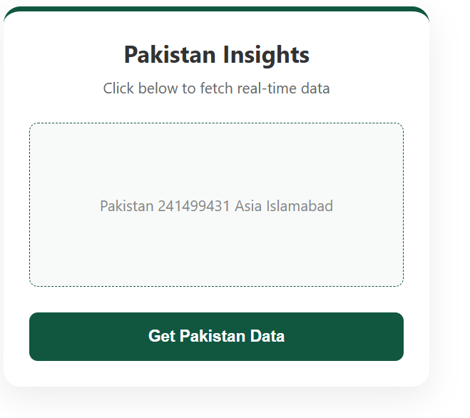

# 🚀 JavaScript Fundamentals & Dynamic API Integration

Welcome to my core JavaScript learning and implementation repository! This folder contains cleanly structured examples of foundational JavaScript concepts, combined with real-world DOM manipulation, asynchronous programming, and dynamic API data fetching.

## 📁 What's Inside This Folder?

### 1. `script.js` (JavaScript Core Concepts)
This file covers everyday production-level JavaScript fundamentals:
* **Variables & Data Types:** String interpolation using Template Literals (`` ` ``).
* **Functions:** Comparison between traditional function declarations and modern ES6 Arrow Functions (`=>`).
* **Control Flow:** Conditional logic (`if/else`) grading automation based on input values.
* **Loops & Arrays:** Iteration mechanics comparing standard `for` loops with optimized `.forEach()` methods.
* **Modern Array Methods:** Production-heavy data manipulation techniques featuring:
  * `.filter()` to isolate items matching specific conditions.
  * `.map()` to transform element arrays seamlessly.
  * `.find()` to quickly extract matching objects.


### 2. `index.html` (Pakistan Insights Data Card)
A web application UI built to put JavaScript logic to work:
* **Asynchronous Fetch:** Implements `async/await` to pull asynchronous live data from the third-party REST Countries API.

* **Dynamic DOM Manipulation:** Real-time selector updates displaying population metrics, capital coordinates, and territorial regions instantly.
* **Interactive UI/UX State:** Implements custom CSS keyframe `@keyframes` loaders alongside `setTimeout` intervals for interactive loading spinners.

### 3. `neon-button.html` (Advanced Interaction States)
A UI sandbox experiment for front-end responsiveness:
* **Active CSS Transforms:** Implements hardware-accelerated `:active` layout scaling metrics.
* **Vibrant Box Shadows:** Implements custom neon glow drop-shadow filters on component clicks.

---

## 🛠️ Tech Stack Used
* **Languages:** HTML5, CSS3, JavaScript (ES6+)
* **APIs:** REST Countries API (`https://restcountries.com`)
* **Design Elements:** CSS Animations, Flexbox, Theme-driven Custom Colors (`#115740` Pakistan Green)

---

## 🚀 How to Run the Projects Locally

1. **Clone or Download the Folder:**
   Ensure all three files (`script.js`, `index.html`, and `neon-button.html`) reside together in the same workspace directory.

2. **Run the JavaScript Logic:**
   Open your browser terminal, or execute the core engine directly via Node.js:
   ```bash
   node script.js
   ```

3. **Launch the User Interfaces:**
   Simply double-click either `index.html` or `neon-button.html` to open and test their visual elements live in any modern web browser.
